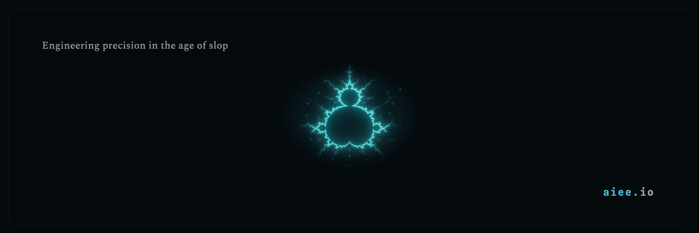

<h1 align="center">AIEE Skills</h1>

<p align="center">Specialist agents, skills, and commands for Claude Code.</p>

<p align="center">
  
</p>

<p align="center">
  <a href="https://github.com/ai-enhanced-engineer/aiee-skills/releases"></a>
  <a href="LICENSE"></a>
  <a href="https://github.com/ai-enhanced-engineer/aiee-skills/actions"></a>
</p>

<p align="center">
  🌐 <a href="https://aiee.io">Website</a> · 📚 <a href="https://aiee.io/learn">Field Guides</a> · 📧 <a href="https://aienhancedengineer.substack.com/">Subscribe</a>
</p>

**11 specialist agents and 102 skills** for Claude Code — the open, curated subset distilled from AIEE's production engineering practice. Install the whole pack or just the technology groups you need.

> New to skills? The [*Agent Skills* series](https://aienhancedengineer.substack.com/) covers the *why* — how a skill earns its place, where new ones come from, and how the library stays honest. This repo is the *how*.

---

## Table of Contents

- [Quick Start](#quick-start)
- [Install by Technology](#install-by-technology)
- [The Team](#the-team)
- [The Skills](#the-skills)
- [Commands](#commands)
- [Repository Structure](#repository-structure)
- [Contributing](#contributing)
- [License](#license)

---

## Quick Start

**Plugin marketplace** (recommended for Claude Code):

```shell
/plugin marketplace add ai-enhanced-engineer/aiee-skills
/plugin install aiee-skills@aiee-skills
/agents   # verify the specialists are listed
```

**npx** (no marketplace — copies into a `.claude` directory):

```shell
npx aiee-skills install              # into ./.claude for this project
npx aiee-skills install --global     # into ~/.claude for every project
```

Runs straight from GitHub before any npm publish: `npx github:ai-enhanced-engineer/aiee-skills install`. Other commands: `--dry-run`, `--force`, `uninstall`, `--help`.

**Local development:** `git clone https://github.com/ai-enhanced-engineer/aiee-skills.git` then `claude --plugin-dir ./`. JSON manifests validate with `just validate`.

## Install by Technology

The pack is grouped by technology, and each group brings its **specialist agent(s) plus skills**. `dev-practices` is shared by every agent, so it's always included. A full install (no `--groups`) gets all 11 agents and 102 skills.

```shell
npx aiee-skills --list-groups                              # groups, skill + agent counts
npx aiee-skills install --groups=frontend-web,backend-api  # install just those
```

| Group | Skills | Agents | Covers |
|-------|:--:|:--:|--------|
| `frontend-web` | 25 | aiee-frontend-engineer | React / Angular / Svelte / Next.js, CSS, forms, web a11y |
| `mobile` | 20 | aiee-mobile-engineer, aiee-ios-engineer | React Native / Expo, iOS / Swift / SwiftUI, watchOS |
| `backend-api` | 20 | aiee-backend-engineer, aiee-data-engineer | FastAPI / NestJS / Laravel, databases, ORMs, auth |
| `cloud-infra` | 17 | aiee-devops / sre / observability / security-engineer | GCP / AWS / Azure, Terraform, CI/CD, observability |
| `architecture` | 7 | aiee-systems-architect | DDD, ADRs, diagrams, events, MVP roadmap, compliance |
| `python-core` | 5 | aiee-python-expert-engineer | Modern Python, Poetry, Docker, ruff |
| `dev-practices` | 4 | _(core — always installed)_ | Standards, debugging, performance, test standards |
| `ai-ml` | 4 | _(skills only)_ | Vision/video, on-device Apple AI, LangChain + Azure OpenAI |

## The Team

Eleven specialists, each composed from the skills it loads. Claude routes to them automatically, or you can name one: *"Use the aiee-backend-engineer agent to design the auth API."*

| Agent | Role |
|-------|------|
| `aiee-backend-engineer` | Python, PHP/Laravel, and TypeScript/NestJS — API design, database modeling, system integration |
| `aiee-data-engineer` | PostgreSQL/MySQL schema design, migrations, RLS security, query optimization |
| `aiee-devops-engineer` | CI/CD pipelines, Infrastructure as Code, deployment automation, container orchestration |
| `aiee-frontend-engineer` | Svelte 5, SvelteKit, Angular 21+, and React web engineering |
| `aiee-ios-engineer` | Native iOS + watchOS — Swift 6, SwiftUI, HealthKit, Apple Foundation Models, on-device AI |
| `aiee-mobile-engineer` | React Native + Expo for iOS/Android |
| `aiee-observability-engineer` | Monitoring, alerting, logging, distributed tracing |
| `aiee-python-expert-engineer` | Modern Python architecture, async patterns, performance, code review |
| `aiee-security-engineer` | Threat modeling, penetration testing, compliance (SOC 2, GDPR, OWASP) |
| `aiee-sre-engineer` | Operational readiness, runbooks, disaster recovery, incident response |
| `aiee-systems-architect` | Architecture reviews, service design, API contracts, legacy assessments |

## The Skills

102 skills across the eight groups above, each a `SKILL.md` directory (plus optional `reference.md` / `examples.md`). Browse them live:

```shell
npx aiee-skills --list-groups      # every group and its skill count
ls skills/                       # the full directory of 102 skills
```

The complete skill→group and agent→group mapping lives in [`groups.json`](groups.json).

## Commands

Two slash commands run quality-gated implementation cycles:

| Command | Purpose |
|---------|---------|
| `/aiee-backend` | Backend implementation with 2-phase gated review (quality + security → tests) |
| `/aiee-frontend` | Frontend implementation with 2-phase gated review (architecture + security → tests) |

Each takes a `fix:`, `feat:`, or `refactor:` task, implements it with the matching specialist, runs parallel reviews, then a test-enforcement gate (80% coverage), iterating up to three cycles. See [`commands/`](commands/) for the full workflow.

## Repository Structure

```
aiee-skills/
├── .claude-plugin/       # plugin.json + marketplace.json (Claude Code plugin)
├── agents/               # 11 specialist agent definitions
├── bin/install.js        # npx installer
├── commands/             # slash commands (/aiee-backend, /aiee-frontend)
├── skills/               # 102 skills, one SKILL.md directory each
├── groups.json           # skill + agent → install-group taxonomy
├── justfile              # dev tasks (just validate, just skills, ...)
└── package.json          # npm package (bin + files for npx)
```

## Contributing

| I want to... | Guide |
|--------------|-------|
| Add or modify an **agent** | [`agents/README.md`](agents/README.md) |
| Add or modify a **skill** | [`skills/README.md`](skills/README.md) |

After changes, update the tables in this README **and** the mapping in [`groups.json`](groups.json) so new agents and skills are reachable via `npx aiee-skills install --groups=...`. Run `npx aiee-skills --list-groups` to confirm nothing is left ungrouped.

## License

MIT — see [LICENSE](LICENSE).

---

*Engineering precision, not slop. Domain expertise on demand, for engineers building real systems.*

📬 [Subscribe](https://aienhancedengineer.substack.com/) for production AI engineering — real patterns, real code, real lessons.
