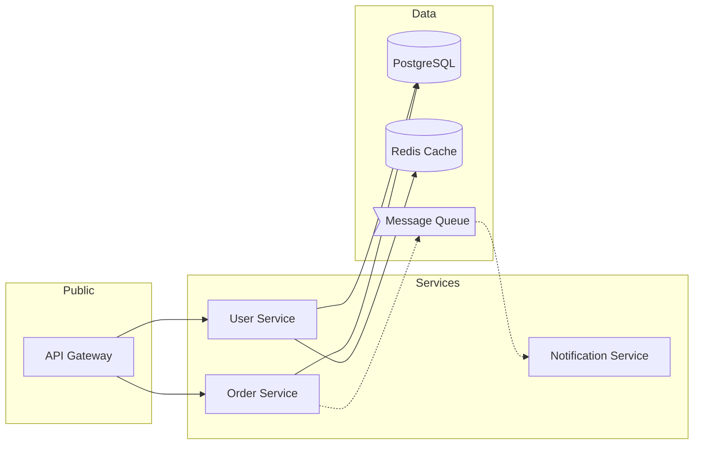
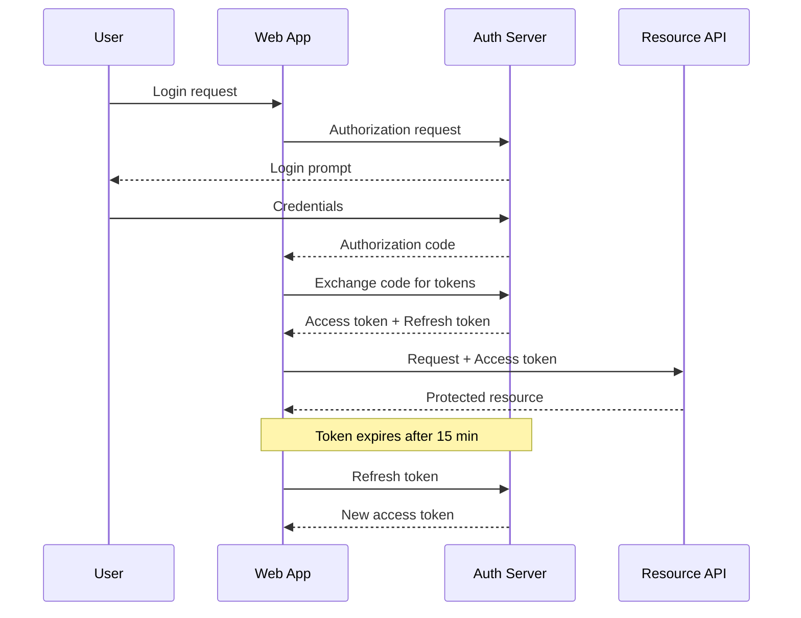
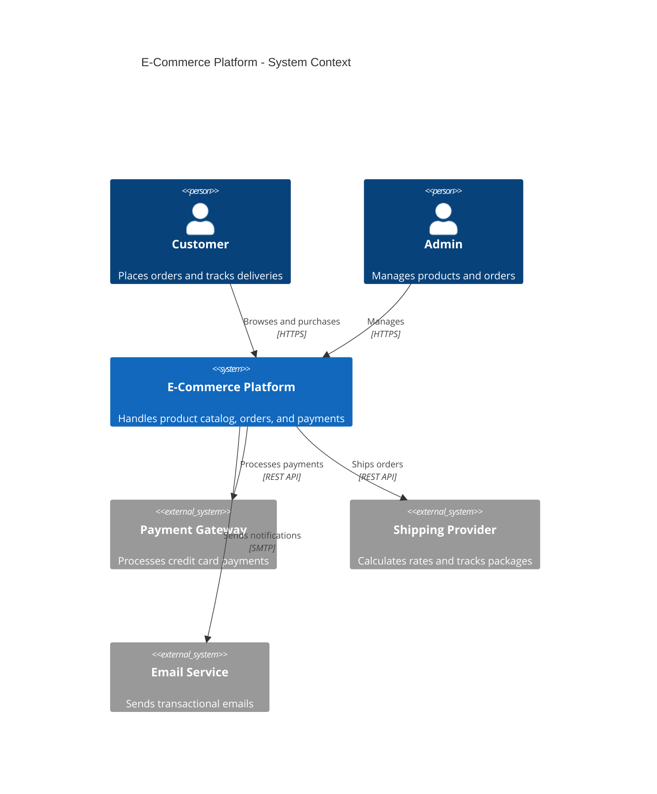

# Architecture Diagrams Examples

Annotated examples for common architecture visualization scenarios.

## Microservice Communication Flow

Shows service-to-service communication with async messaging.



**Why this works:**
- Left-to-right flow mirrors request direction
- Subgraphs group by deployment boundary
- Dotted arrows distinguish async from sync calls

## Authentication Sequence

Shows the OAuth2 authorization code flow with token refresh.



**Why this works:**
- Participants ordered left-to-right by trust level
- Notes clarify timing constraints
- Response arrows use dashed style

## System Context (C4 Level 1)

High-level view showing the system and its external dependencies.



**Why this works:**
- Focuses on what the system does, not how
- External systems clearly marked with `System_Ext`
- Relationships include protocol

## Decision Matrix

Use tables when comparing options across multiple criteria.

```markdown
| Criteria (weight) | PostgreSQL | DynamoDB | MongoDB |
|--------------------|-----------|----------|---------|
| ACID compliance (5) | 5 (25) | 2 (10) | 3 (15) |
| Horizontal scale (3) | 2 (6) | 5 (15) | 4 (12) |
| Query flexibility (4) | 5 (20) | 2 (8) | 4 (16) |
| Ops complexity (3) | 4 (12) | 5 (15) | 3 (9) |
| **Total** | **63** | **48** | **52** |
```

**Why this works:**
- Weighted scoring makes trade-offs explicit
- Supports ADR decisions with quantified reasoning

## ASCII Deployment Diagram

Quick sketch for documentation or chat when Mermaid isn't available.

```
┌─────────────────────────────────────────────────┐
│                  GCP Project                     │
│                                                  │
│  ┌──────────────┐       ┌──────────────────┐    │
│  │  Cloud Run    │       │  Cloud SQL       │    │
│  │  ┌─────────┐ │       │  ┌────────────┐  │    │
│  │  │ API     │─┼───────┼─▶│ PostgreSQL │  │    │
│  │  └─────────┘ │       │  └────────────┘  │    │
│  │  ┌─────────┐ │       └──────────────────┘    │
│  │  │ Worker  │─┼──┐                             │
│  │  └─────────┘ │  │    ┌──────────────────┐    │
│  └──────────────┘  │    │  Memorystore     │    │
│                     └────┼─▶│ Redis        │    │
│                          │  └──────────────┘    │
│                          └──────────────────┘    │
└─────────────────────────────────────────────────┘
```

**Why this works:**
- No tooling required, works in any text editor
- Box-drawing characters create clean boundaries
- Arrows show data flow direction
