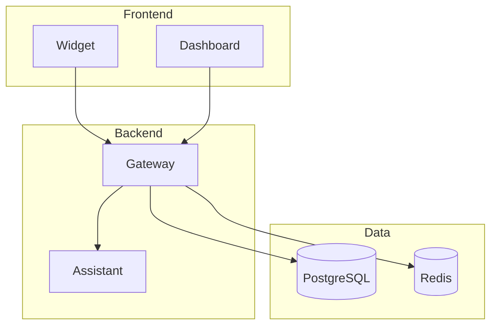
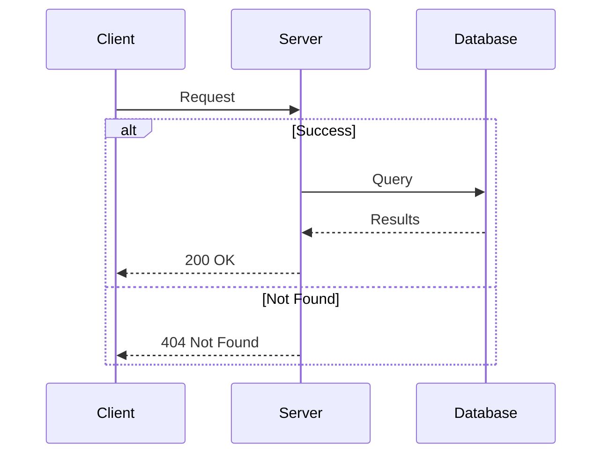
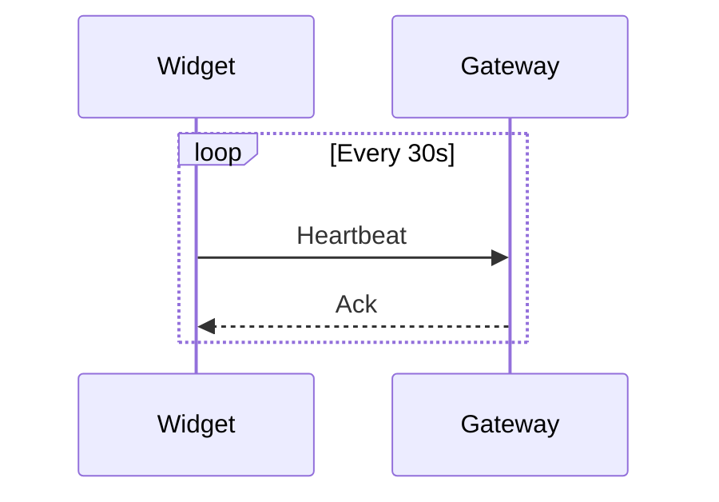
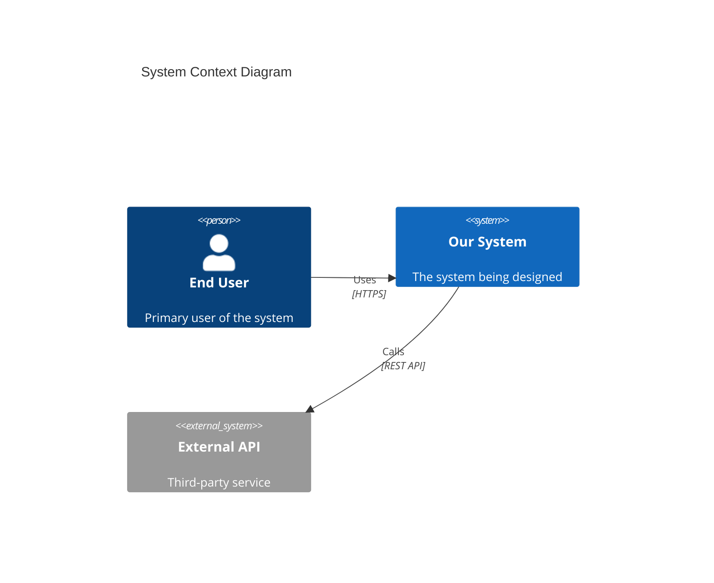
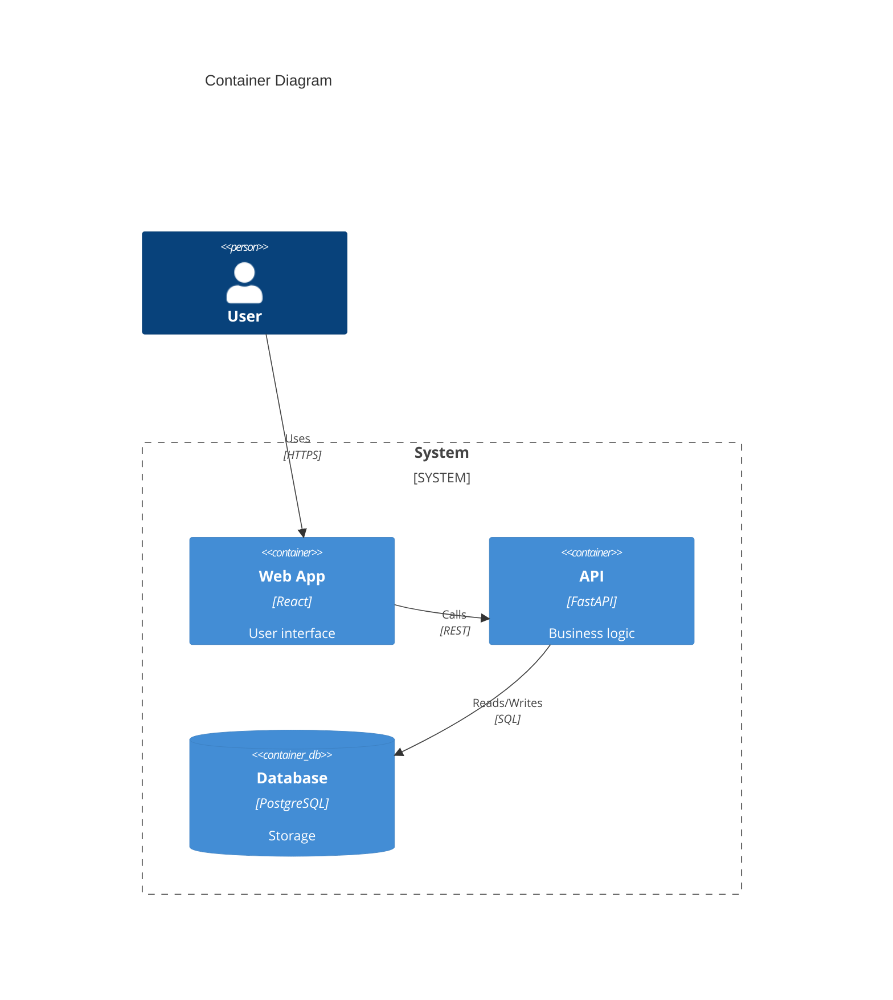

# Architecture Diagrams Reference

Complete syntax reference for architecture visualization.

## Mermaid Flowchart Reference

### Node Shapes

| Shape | Syntax | Use Case |
|-------|--------|----------|
| Rectangle | `[text]` | Services, components |
| Rounded | `(text)` | Processes, actions |
| Stadium | `([text])` | Start/end points |
| Database | `[(text)]` | Data stores |
| Circle | `((text))` | Events, triggers |
| Diamond | `{text}` | Decisions |

### Arrow Types

| Arrow | Syntax | Meaning |
|-------|--------|---------|
| Solid | `-->` | Direct call/dependency |
| Open | `---` | Association (no direction) |
| Dotted arrow | `-.->` | Async call |
| Thick | `==>` | Primary/critical path |

### Subgraphs



## Sequence Diagram Reference

### Message Types

| Syntax | Type | Use Case |
|--------|------|----------|
| `->>` | Solid arrow | Synchronous request |
| `-->>` | Dashed arrow | Response or async |
| `-)` | Open arrow | Fire-and-forget |
| `-x` | X arrow | Failed/lost message |

### Control Flow



> **Important**: The keyword `end` must match the case used to open the block.

### Loops



## C4 Model Reference

> **Note**: C4 diagrams in Mermaid are experimental.

### C4 Context (Level 1)



### C4 Container (Level 2)



## ASCII Diagram Patterns

### Request Flow

```
┌──────────┐    ┌──────────┐    ┌──────────┐    ┌──────────┐
│  Client  │───▶│  Widget  │───▶│ Gateway  │───▶│  Backend │
└──────────┘    └──────────┘    └──────────┘    └──────────┘
     │               │               │               │
     │   Load Page   │               │               │
     │──────────────▶│               │               │
     │               │  WS Connect   │               │
     │               │──────────────▶│               │
     │               │               │   HTTP POST   │
     │               │               │──────────────▶│
     │               │               │◀──────────────│
     │               │◀──────────────│   Response    │
     │◀──────────────│   Display     │               │
```

### Decision Tree

```
                     ┌─────────────────────┐
                     │  Need Real-time?    │
                     └──────────┬──────────┘
                                │
                ┌───────────────┴───────────────┐
                │ Yes                       No  │
                ▼                               ▼
      ┌─────────────────┐             ┌─────────────────┐
      │   WebSocket     │             │   REST API      │
      │ (Bidirectional) │             │   (Polling OK)  │
      └─────────────────┘             └─────────────────┘
```

## Best Practices

### Readability

1. **Limit nodes** - Max 7-10 per diagram, split if needed
2. **Use consistent direction** - TD for hierarchy, LR for flows
3. **Group related items** - Subgraphs for logical boundaries
4. **Label all connections** - Protocol, format, or action

### Documentation

1. **Add context** - What decision does this support?
2. **Link to ADRs** - Reference architectural decisions
3. **Include legends** - Define abbreviations and symbols
